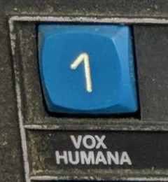

# Vox Humana for Korg Minilogue-xd



This is a custom oscillator for the [Korg _Minilogue-xd_](https://www.korg.com/products/synthesizers/minilogue_xd) hardware music synthesizer. It may also work on other synthesizers compatible with [_Logue SDK 1.1-0_](https://korginc.github.io/logue-sdk/) (_NTS-1_ and _Prologue_), but it was not tested on these instruments.

This oscillator attempts to simulate the famous _Vox Humana_ preset from the _Polymoog Keyboard 280a_, prevalent in the early recordings by Gary Numan (mostly on the _Pleasure Principle_ album). This custom oscillator implements two wave oscillators and three LFOs that are configurable. The rest of the sound creation process (filter, envelope, effects) is controlled by the synthesizer itself.

"__Vox Humana__: A synthesized vocal ensemble sound with a slow attack and wide vibrato, characteristic of the human voice" (from the _Polymoog 280a_ user manual).


## How it works

The oscillator was created using information from 
the _Keyboard_ magazine article: [_Steal This Sound, Gary Numan's “Cars”_](https://web.archive.org/web/20150928161839/http://www.keyboardmag.com/create-sounds/1256/steal-this-sound-gary-numans-cars/28419),
and from the YouTube video:
[_Polymoog "Vox Humana" preset | Showcase & Tutorial_](https://www.youtube.com/watch?v=W1mi1L1AuSI), by _nonedescriptivep_.

In short, two slightly detuned oscillators are used: one for the sawtooth wave, and another for the pulse (square) wave. Three low frequency oscillators (LFOs) are used to modulate the pitch of each oscillator, and pulse width of the pulse wave, with different rates and amounts. The rest of the preset is a low-pass filter, a volume envelope (moderate attack and long release) and optionally, the effects (reverb, phaser, etc.).

Please remember that the Polymoog used divide down oscillators with a single master clock, which resulted in phase of all keys being always in sync. This is not possible to obtain on Minilogue-xd. Therefore, due to phase differences between voices, the sound will be different, especially when chords are played. However, the character of the preset is retained, and it may be modified by changing the parameters.


## How to install

A binary file of the oscillator is available in the Release section in the GitHub repository. You can also build the oscillator from the source file (see below).

Install the oscillator just like any other custom oscillator, using [_Korg Sound Librarian_](https://www.korg.com/us/support/download/product/0/811/) or the command line _logue-cli_ tool. The synthesizer must be connected through USB to a computer which has [Korg USB driver](https://www.korg.com/us/support/download/driver/0/811/3541/) installed. Refer to the Korg documentation for details.

With **Sound Librarian** : start the application and make sure that it communicates with the synthesizer via the USB MIDI port. Switch to the _User Oscillators_ tab. Click the _User OSC/FX Receive All_ button and wait until the list is populated. Drag the oscillator file onto a selected slot. Press the _User OSC/FX Send All_ button. Done.

With **logue-cli** : run the following command, substituting the slot number 0-15 for ```#``` and providing the path to the correct oscillator file version for the synthesizer (example for _Minilogue xd_):

```
logue-cli load -u voxhumana.mnlgxdunit -s #
```


## How to use

Select the custom oscillator by switching the multi oscillator mode to _USR_ and selecting the slot containing the oscillator with the _TYPE_ knob. Set the volume of _MULTI_ in the mixer above zero. Mute VCO1 and VCO2 in the mixer if you don't use them.

You can adjust the parameters of the custom oscillator with the _SHAPE_ knob and with the options in the menu.

__FILTER__: set to your liking. Usually, cutoff is in the 1-3 kHz range, resonance is 0-25%. The author used _CUTOFF_ 814, _RESONANCE_ 0. Set _KEY TRACK_ to a middle position (50%).

__AMP EG__ (amplitude envelope): set a short to moderate attack (e.g. 0.2 s) and a long release (e.g. 4 s). Leave the decay at zero, the sustain at maximum. The author used _ATTACK_ 300, _RELEASE_ 600.

__EFFECTS__: you can try adding a reverb, a phaser, or other effects to your liking. However, the dry preset without effects is already rich enough.

You can also mix in VCO1 and VCO2 if you want, to get even richer sound.

Experiment with all the settings, find a setup that you like best.


## Parameters

The modulation rate (frequency) and depth (amount) of the three LFOs can be adjusted using a menu: _EDIT MODE_, _PROGRAM EDIT_, _MULTI ENGINE_ (button 10). All parameters are in the 0-100% range.

The _SHAPE_ parameter controls the amount of the sawtooth wave in the mix with the pulse wave. At 0: only the pulse wave is used; at 50: both waves are mixed in equal amount; at 100: only the sawtooth wave is used.

The _SHIFT+SHAPE_ parameter (turn the _SHAPE_ knob while the _SHIFT_ key is pressed) introduces a negative detuning (flattening) of the sawtooth wave relative to the main pitch. The range is 100 cents, 1% is 1 cent.

The default values, given in the table below, were set mostly according to the _Keyboard_ magazine article. Pulse width of the unmodulated pulse wave is 50%.

| Parameter             | Description                               | Unit   | Default     |
| --------------------- | ----------------------------------------- | ------ | ----------- |
| Shape                 | Amount of the saw wave in the mix         | %      | 50          |
| Shift+Shape           | Negative detuning of the saw wave         | cent   | 4 (-4 c)    |
| Saw Rate (Param 1)    | Modulation rate of the saw wave pitch     | 0.1 Hz | 50 (5 Hz)   |
| Saw Depth (Param 2)   | Modulation amount of the saw wave pitch   | cent   | 50          |
| Pulse Rate (Param 3)  | Modulation rate of the pulse wave pitch   | 0.1 Hz | 35 (3.5 Hz) |
| Pulse Depth (Param 4) | Modulation amount of the pulse wave pitch | cent   | 31          |
| PWM Rate (Param 5)    | Modulation rate of the pulse width        | 0.1 Hz | 20 (2.0 Hz) |
| PWM Depth (Param 6)   | Modulation amount of the pulse width      | 0.5%   | 62 (31%)    |


## Building from the source

All the files necessary to build the oscillator from the source are included in the repository. You only need a compiler (GCC for ARM), and `make` and `zip` utilities.

If you don't already have a compiler, you can use the scripts in the `logue-sdk/tools/gcc` directory to download the compiler, version `gcc-arm-none-eabi-10-2020-q4-major`. This version was tested by the author, but other GCC versions should work as well.

Building the oscillator requires only issuing the `make install` command in the main directory of the repository. All three binaries for the supported synthesizers should be created in this directory.

If you already have a working compiler installed, you can pass the location of a directory containing the compiler binaries (`bin`) as a `GCC_BIN_PATH` parameter when invoking `make`. For example:

```
make install GCC_BIN_PATH=../../gcc-arm-none-eabi-10-2020-q4-major/bin
```


## License

The software is licensed under the terms of the GNU General Public License v3.0. See the LICENSE.md file for details.
